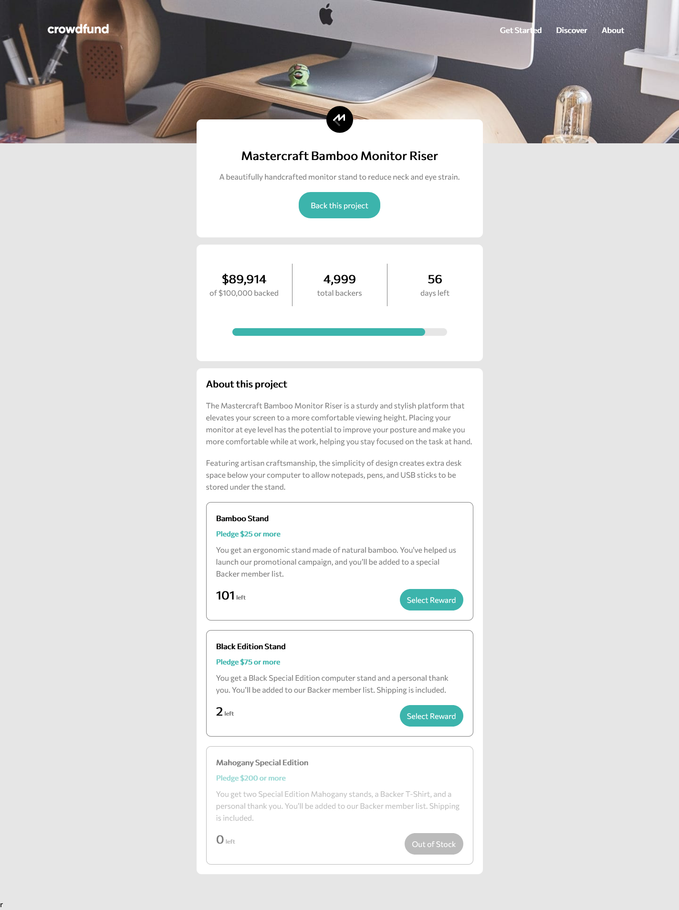
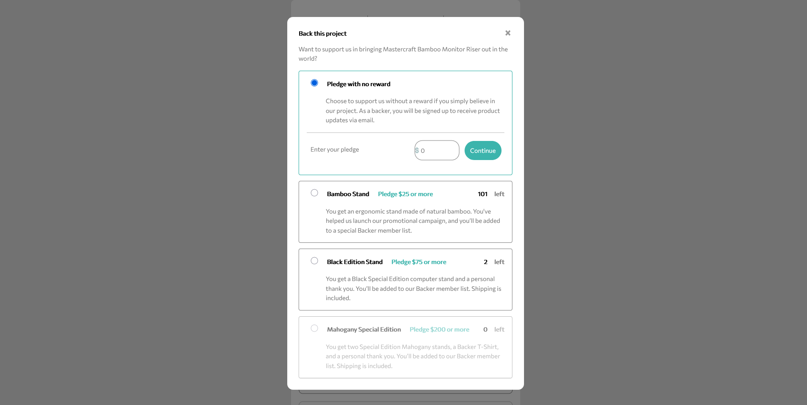
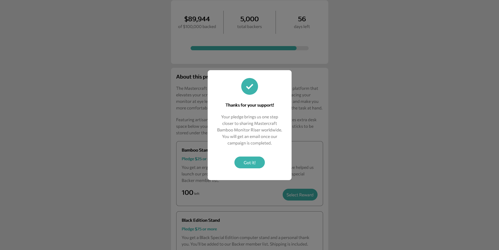
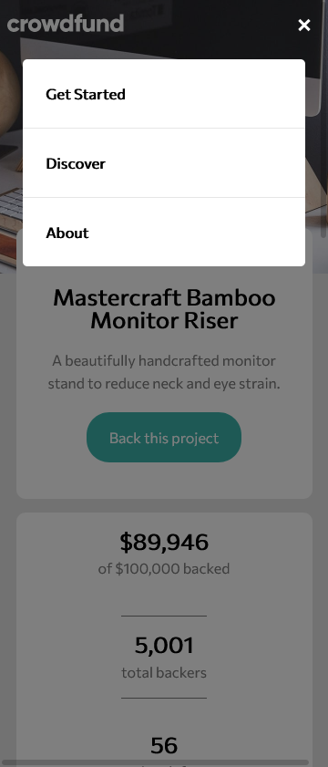
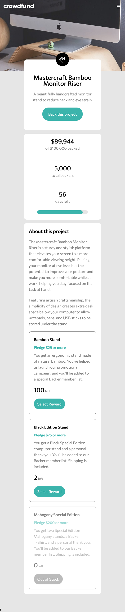
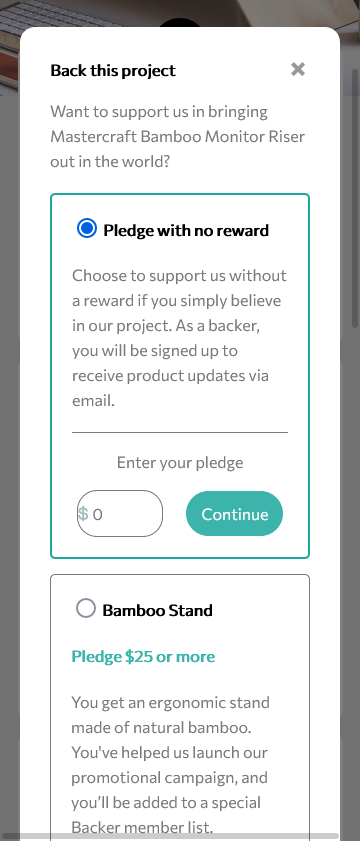
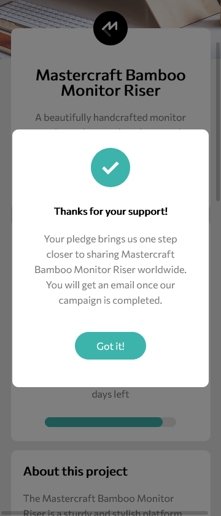

# Crowdfunding page
A demo page for a crowdfunding page using responsive design.

Users can:

- View the optimal layout depending on their device's screen size.
- See hover states for interactive elements.
- Make a selection of which pledge to make.
- See an updated progress bar and total money raised based on their pledge total after confirming a pledge.
- See the number of total backers increment by one after confirming a pledge.

## SCRENSHOOTS

#### Desktop view

**Starting page**

**Overlay to back the project**

**Thanks overlay**

####Mobile view

**Menu**

**Starting page**

**Overlay to back project**

**Thanks overlay** 

